REPORTE PRACTICA_2 - JOBS
Oziel Elias Rodriguez Gonzalez
Base de Datos II
Practica 2 - JOBS
13/09/2026

---

Marco Teorico:
Un jobs es un sistema que funciona mediante un evento es decir se hace un evento y se establece cada cuanto y por cuanto tiempo se repetira esto lo podemos ver con sintaxis en mysql como un (CREATE EVENT) y (AT SCHEDULE ON) estos dos comandos nos ayudan a poder crear un jobs y establecer su funcionamiento es decir
esto hace que podamos ahorrar tiempo a diferencia de los procesos manuales esto crea una automatizacion como la de actualizar estados y poder hacer listados o resumenes (recuentos) del dia, semana o mes en curso esto es una excelente ventaja porque el costo operativo se vuelve de una sola vez.

---

Disenio:
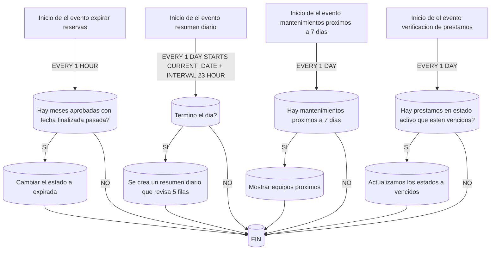

---

Conclusion:
En esta practica pude mejorar mi tiempo de identificacion de los datos necesarios para iniciar y definir un job como tambien mi velocidad a la hora de escribir la sintaxis y los datos mi tiempo fue rapidamente cambiante y generalmente me ayudo a poder identificar que datos pueden ir si bien el primero me tardo unas horas los demas fueron mas rapidos y eficientes

---

Eviencias:
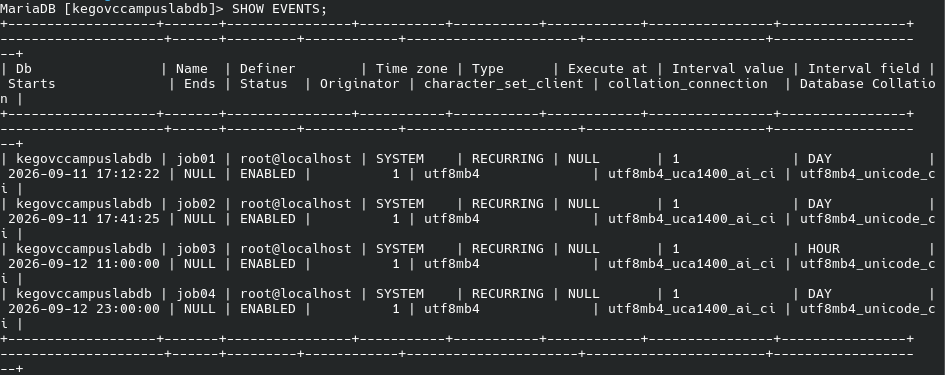
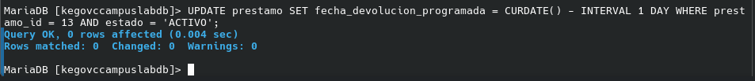
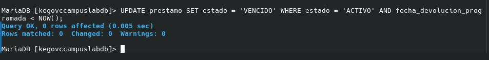
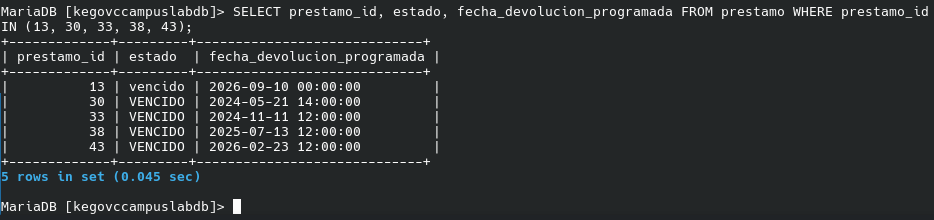
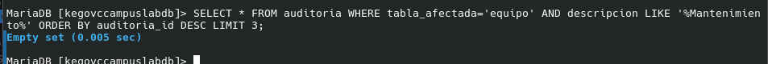
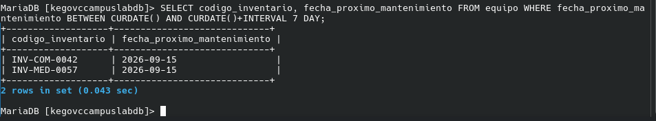
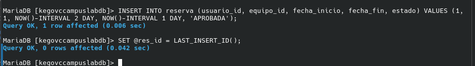
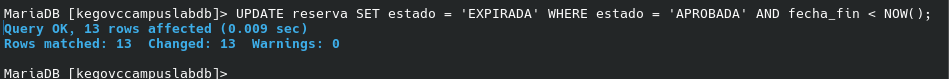
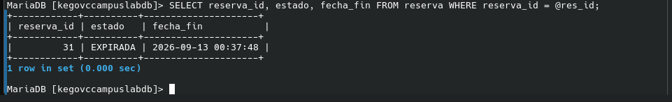
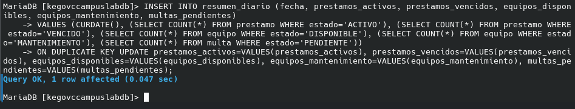
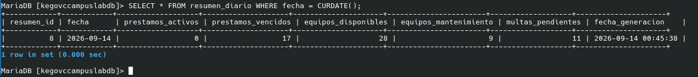

---

Comparativa:
hay una diferencia significativa entre mysql y postgres con pg_cron como esta seria que para poder hacer estos eventos o jobs en mysql son nativos y en postgres necesitas una extencion si bien no es muy relevante y bastante comun las extensiones es notorio y tambien su sintaxis es diferente como por decir en mysql (CREATE EVENT) y en postgres (CREATE FUNCTION) esto nos da un panorama de que su constitucion es diferente pero su forma de controlarlos no lo son tanto un ejemplo es mysql (SHOW EVENTS, DISABLE/ENABLE)      postgres(SELECT FROM cron.job)

---

Comandos de comprobacion:
JOB01/
-- Forzar vencido (si no lo está)
UPDATE prestamo SET fecha_devolucion_programada = CURDATE() - INTERVAL 1 DAY WHERE prestamo_id = 13 AND estado = 'ACTIVO';

-- Ejecutar JOB01 (lógica manual)
UPDATE prestamo SET estado = 'VENCIDO' WHERE estado = 'ACTIVO' AND fecha_devolucion_programada < NOW();

-- DESPUÉS
SELECT prestamo_id, estado, fecha_devolucion_programada FROM prestamo WHERE prestamo_id IN (13, 30, 33, 38, 43);

JOB02/
-- Verificar auditoría (JOB02 debería dejar registro)
SELECT * FROM auditoria WHERE tabla_afectada='equipo' AND descripcion LIKE '%Mantenimiento%' ORDER BY auditoria_id DESC LIMIT 3;

-- DESPUÉS (mismo SELECT, solo verifica que detecta)
SELECT codigo_inventario, fecha_proximo_mantenimiento FROM equipo WHERE fecha_proximo_mantenimiento BETWEEN CURDATE() AND CURDATE()+INTERVAL 7 DAY;

JOB03/
-- Forzar reserva expirada
INSERT INTO reserva (usuario_id, equipo_id, fecha_inicio, fecha_fin, estado) VALUES (1, 1, NOW()-INTERVAL 2 DAY, NOW()-INTERVAL 1 DAY, 'APROBADA');
SET @res_id = LAST_INSERT_ID();

-- Ejecutar JOB03 (lógica manual)
UPDATE reserva SET estado = 'EXPIRADA' WHERE estado = 'APROBADA' AND fecha_fin < NOW();

-- DESPUÉS
SELECT reserva_id, estado, fecha_fin FROM reserva WHERE reserva_id = @res_id;

JOB04/
-- Ejecutar JOB04 (manual)
INSERT INTO resumen_diario (fecha, prestamos_activos, prestamos_vencidos, equipos_disponibles, equipos_mantenimiento, multas_pendientes)
VALUES (CURDATE(), (SELECT COUNT(*) FROM prestamo WHERE estado='ACTIVO'), (SELECT COUNT(*) FROM prestamo WHERE estado='VENCIDO'), (SELECT COUNT(*) FROM equipo WHERE estado='DISPONIBLE'), (SELECT COUNT(*) FROM equipo WHERE estado='MANTENIMIENTO'), (SELECT COUNT(*) FROM multa WHERE estado='PENDIENTE'))
ON DUPLICATE KEY UPDATE prestamos_activos=VALUES(prestamos_activos), prestamos_vencidos=VALUES(prestamos_vencidos), equipos_disponibles=VALUES(equipos_disponibles), equipos_mantenimiento=VALUES(equipos_mantenimiento), multas_pendientes=VALUES(multas_pendientes);

-- DESPUÉS
SELECT * FROM resumen_diario WHERE fecha = CURDATE();
